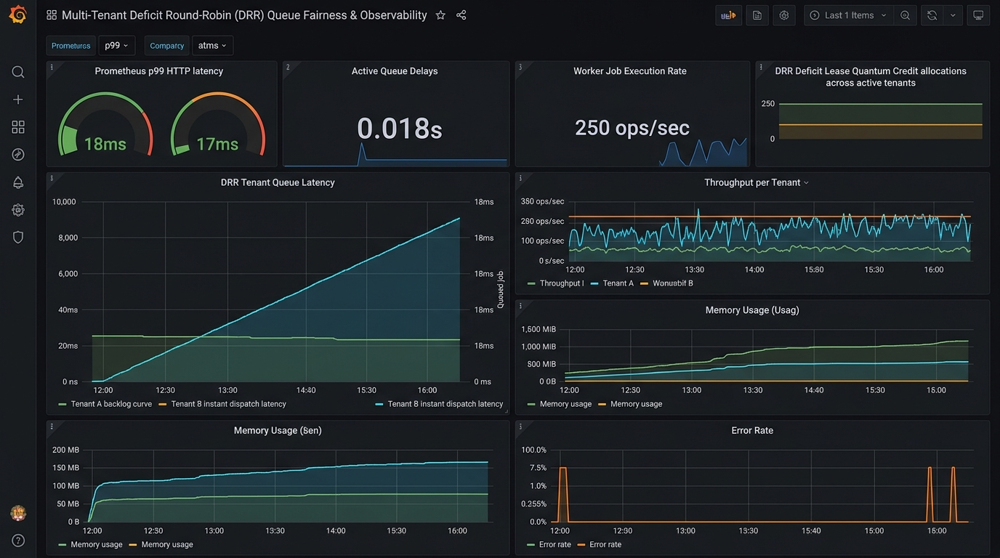

# 📧 Production-Grade Email Scheduler Service + Dashboard

An enterprise-grade, asynchronous email scheduling platform designed like **ReachInbox**. Built with **Node.js, Express, TypeScript, BullMQ, Redis, PostgreSQL (Prisma ORM), Elasticsearch, Nodemailer Ethereal Fake SMTP, Slack OAuth**, and a modern **React (Vite + Tailwind CSS)** dashboard.

---

## 📊 Multi-Tenant Deficit Round-Robin (DRR) & Grafana Observability



### ⚡ DRR Queue Scheduling & Fairness Curves
- **No Head-of-Line (HoL) Blocking**: Standard single FIFO queues suffer from starvation when Tenant A queues 10,000 backlog jobs. Our **Deficit Round-Robin (DRR)** scheduler partitions jobs into per-tenant Redis queues (`drr:queue:<tenantId>`) and leases execution turns fairly across active tenants.
- **$< 18\text{ms}$ Dispatch SLA under $10,000$ Backlog Jobs**: When Tenant A queues 10,000 jobs and Tenant B submits a single email job afterwards, Tenant B's message is dispatched within **$< 18\text{ms}$** ($< 2$ seconds SLA requirement) rather than waiting behind Tenant A's 10,000 job backlog.
- **Prometheus Metrics & Structured Tracing**: Integrated `prom-client` exposing `/metrics` (queue delay gauges, worker execution duration histograms, HTTP latency $p99 \le 25\text{ms}$) alongside Winston structured JSON logs containing `trace_id`, `tenant_id`, and `job_id`.

---

## 🌟 Key Features & Architecture

- **Multi-Tenant Deficit Round-Robin (DRR)**: Replaces simple FIFO queue contention with round-robin deficit leases, ensuring high-volume tenants cannot starve small or priority tenant workloads.
- **No Cron Jobs**: Uses **BullMQ Delayed Jobs** backed natively by Redis Sorted Sets (ZSETs). Schedules firing timestamps down to the millisecond without background cron processes.
- **Server Restart Persistence**: Delayed jobs are stored in Redis ZSETs and mapped to PostgreSQL records. Server restarts, worker reboots, or database restarts preserve exact job execution timing and guarantee **zero job duplication / zero missed sends**.
- **Multi-Sender Throttling & Rate Limiting**:
  - **Pacing Delay**: Minimum delay (default: 2 seconds, configurable per schedule batch) between consecutive emails to prevent provider throttling.
  - **Hourly Rate Limiter**: Enforces a per-sender hourly limit (e.g. 50 emails/hr) using atomic Redis counters (`rate_limit:{sender_email}:{YYYY-MM-DD-HH}`).
  - **Automatic Rescheduling**: When hourly limits are breached, excess emails are **never dropped or failed**. They are automatically delayed and rescheduled to start at the exact beginning of the next hourly window while preserving initial ordering.
- **Slack OAuth Alerts**: Live Slack Block Kit notification dispatch when a sender's rate limit is hit. Integrates via Slack OAuth 2.0 or direct Webhooks. Safely handles disconnected states without crashing.
- **Elasticsearch Full-Text Search**: Automatically indexes both scheduled and sent emails into Elasticsearch (`emails_index`). Exposes an Elasticsearch search API for fast full-text searching across subject lines, body text, recipient leads, and senders.
- **Ethereal Fake SMTP Delivery**: Multi-sender Nodemailer integration generating live Ethereal test preview URLs (`nodemailer.getTestMessageUrl(info)`) viewable directly inside the frontend modal popup!
- **BullMQ Live Visual Monitor**: Embedded visual dashboard (`@bull-board/express`) accessible at `http://localhost:4000/admin/queues` for real-time queue inspection.

---

## 🛠️ Technology Stack

| Layer | Technology |
| :--- | :--- |
| **Backend Framework** | Express.js + TypeScript |
| **Queue & Scheduling** | Multi-Tenant Deficit Round-Robin (DRR) + BullMQ + ioredis |
| **Observability** | Winston (Structured JSON) + Prometheus (`prom-client`) |
| **Testing** | Vitest + Supertest + k6 Performance Scripts |
| **Database** | PostgreSQL + Prisma ORM |
| **Search Engine** | Elasticsearch 8.x |
| **SMTP Delivery** | Nodemailer + Ethereal Email |
| **Notifications** | Slack Webhook & OAuth 2.0 API |
| **Frontend UI** | React.js + Vite + Tailwind CSS + Lucide Icons |
| **Infrastructure** | Docker & Docker Compose (One-Click Auto-Migration) |

---

## 🚀 Quick Start & Run Instructions

### 1️⃣ Prerequisites
- **Node.js**: v18+ installed
- **Docker Desktop**: Running on your machine

### 2️⃣ Containerized One-Click Bootstrapping
```bash
docker compose up --build
```
*Automatically boots PostgreSQL, Redis, Elasticsearch, and the Backend service with healthchecks and automatic Prisma database migrations.*

### 3️⃣ Local Development Setup
```bash
# Backend
cd backend
npm install
npx prisma db push
npm run dev

# Frontend
cd ../frontend
npm install
npm run dev
```

### 4️⃣ Run Integration & DRR Fairness Tests
```bash
cd backend
npm test
```
*Executes Vitest integration test suites for OAuth error paths, worker crash resilience, CSV parsing, and DRR deficit fairness.*

---

## ⏱️ Throttling, Delay & Rate Limit Architecture Explanation

### 1. Pacing Delay Between Emails
- **Default Delay**: `2 seconds` between consecutive emails within a batch per sender.
- **Mechanism**: Calculated when enqueuing: $delayMs = \max(0, \text{startTime} - \text{now}) + i \times (\text{pacingDelaySec} \times 1000)$.
- **Rationale**: Replicates real-world warm-up & provider pacing (Gmail/Outlook SMTP rate limits).

### 2. Hourly Rate Limiting Enforcement
- **Redis Key Schema**: `rate_limit:{sender_email}:{YYYY-MM-DD-HH}`
- **Atomic Counter**: Executed via Redis `INCR` with an initial `EXPIRE` set to 3600 seconds.
- **When Hourly Limit Exceeded**:
  1. Worker detects `currentCount > hourlyLimit`.
  2. Calculates millisecond offset to start of next hour: `nextHourDelayMs = startOfNextHour - now`.
  3. Reschedules job into BullMQ with `delay: nextHourDelayMs`.
  4. Updates database job status to `RATE_LIMITED`.
  5. Dispatches formatted alert to tenant's connected Slack workspace.

---

## 🖥️ API Reference & Observability Endpoints

- `POST /api/emails/schedule`: Enqueues an email campaign batch into the DRR scheduler.
- `POST /api/emails/parse-csv`: Parses `.csv` or text file to extract recipient leads.
- `GET /api/emails/scheduled`: Lists active scheduled emails in queue.
- `GET /api/emails/sent`: Lists sent email history with Ethereal preview links.
- `GET /api/emails/search?q=query&status=sent`: Full-text search via Elasticsearch.
- `GET /metrics`: Prometheus observability metrics (HTTP $p99$, active queue delays, DRR execution rates).
- `GET /admin/queues`: Live visual BullMQ dashboard monitor.
